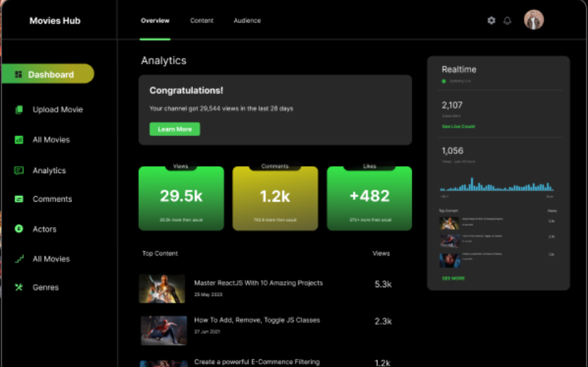

# Movies Web Application 🎥

A sleek and user-friendly web application for browsing and exploring movies. The interface is designed to provide users with easy navigation and a pleasant movie discovery experience.

## Features ✨
- **Home Screen**: Overview of the app with quick navigation links.
- **Browse Movies**: Explore a wide range of movies.
  - **Choose For You**: Personalized movie recommendations.
  - **Top Movies**: List of the top-rated movies.
  - **Choose Movie**: Browse and select specific movies.

- **Bottom Navigation Bar**:  
  Includes intuitive icons for:
  - Home
  - Movie List
  - Logout
  - Profile Access

## Tech Stack 🛠️
- **Frontend**: HTML, CSS, JavaScript
- **Frameworks/Libraries**:
  - React JS
  - Bootstrap (for responsive design)
- **Backend**: Node.js, Express.js
- **Database**: MongoDB (for managing movie data)

## Installation & Setup ⚙️
1. Clone the repository:
   ```bash
   git clone https://github.com/your-username/movies-web.git


1. **Output**
   
   
